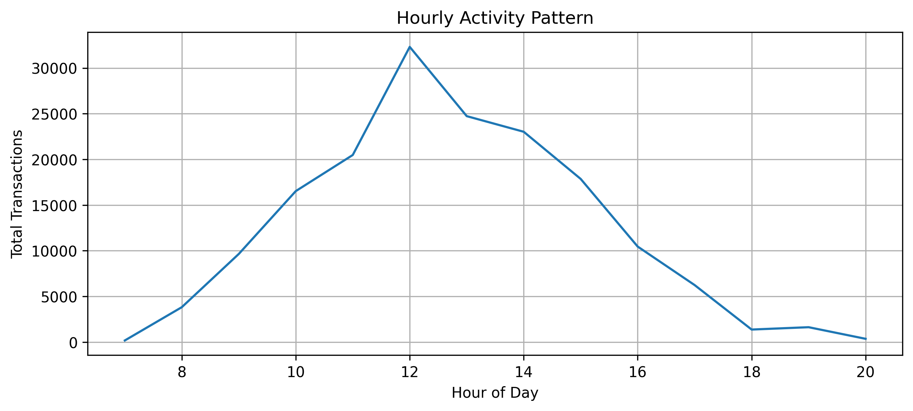
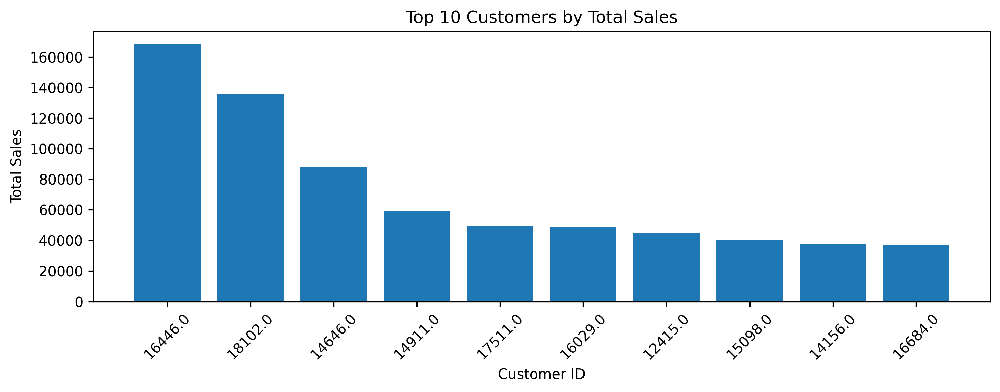
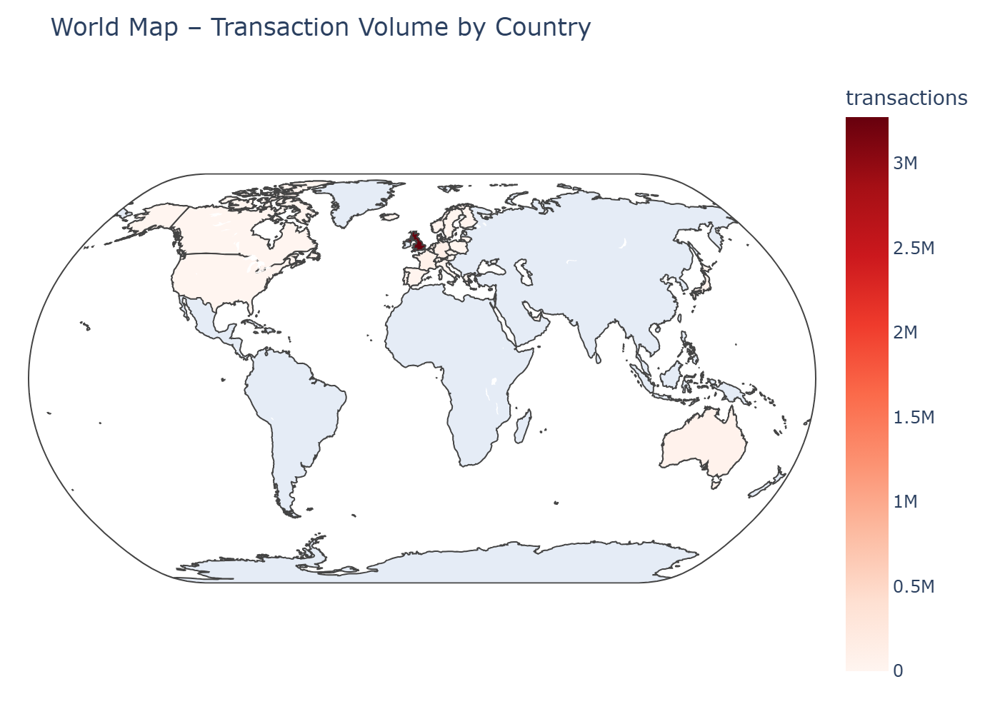

# Online-Retail-Heatmap-Analytics

# 🛒 Online Retail Daily Activity Heatmap & Pattern Discovery

A complete end-to-end data analytics project built in Python + Pandas + NumPy + Matplotlib + Plotly.

## 🚀 Features

- Data cleaning + preprocessing  
- Global day-hour transaction heatmap  
- Country-specific heatmaps  
- Multi-country comparison  
- World map (Plotly Choropleth)  
- Monthly trend analysis  
- Anomaly detection  
- Top customer insights  

## 📁 Files in this repo

- `Daily-Activity-Heatmap-Analysis.ipynb` — main notebook  
- `Online Retail Data Set.csv`  
- `README.md`  

## 📸 Sample Visuals

# Online Retail – Activity Heatmap & Pattern Discovery

This project analyzes the **Online Retail** dataset to find:
- Peak and off-peak activity hours
- Busiest and quietest days
- Country-wise patterns
- Top customers by sales
- Global transaction distribution on a world map

## Overall Activity Heatmap

## Hourly Activity Pattern

## Top Customers by Sales

## World Map – Transaction Volume

## 👨‍💻 Technologies

- Python
- Jupyter Notebook
- Pandas
- NumPy
- Matplotlib
- Plotly
- pycountry

## 📊 Dataset  
From the Online Retail dataset hosted on Kaggle.

## 🔥 Author
Vishwa
